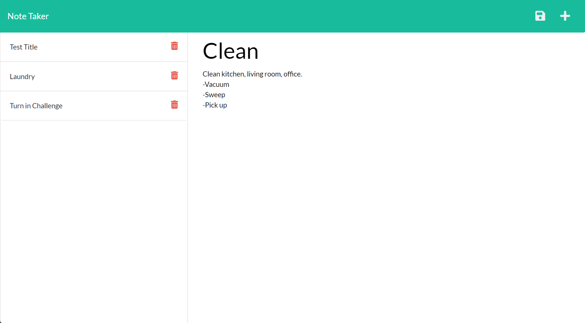

 # Note Taker

  ## Description
  This application is a simple notes tool for organizing thoughts and tasks. It will write and save notes for the user.

  ## Built With
  * JavaScript
  * Node.js
  * Express.js
  * CSS
  * HTML
  * uuid.js

  ## Usage
  This application can be used by anyone needing assistance with keeping track of tasks!  
  Find the finished product [here](https://calm-reef-79631.herokuapp.com/).   
  

  
  ## Contribution
  **I was able to find great resources for Express.js at:**  
  The Express.js lessons at [Codecademy](https://www.codecademy.com/learn/learn-express) for more hands on guided learning.  
  [freeCodeCamp](https://www.freecodecamp.org/news/getting-off-the-ground-with-expressjs-89ada7ef4e59/) had a great article by Victor Ofoegbu for a full explanation and breakdown of Express.  